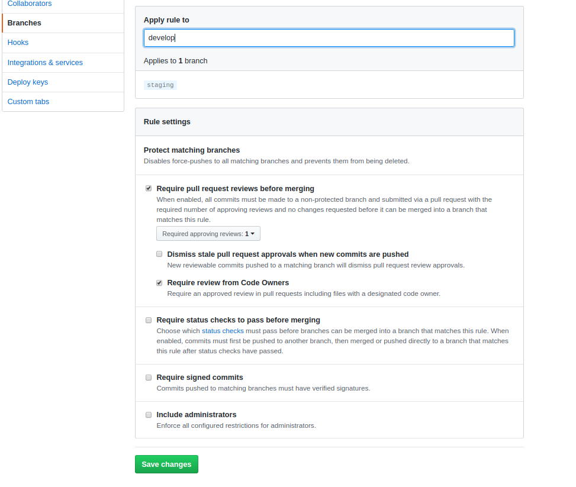
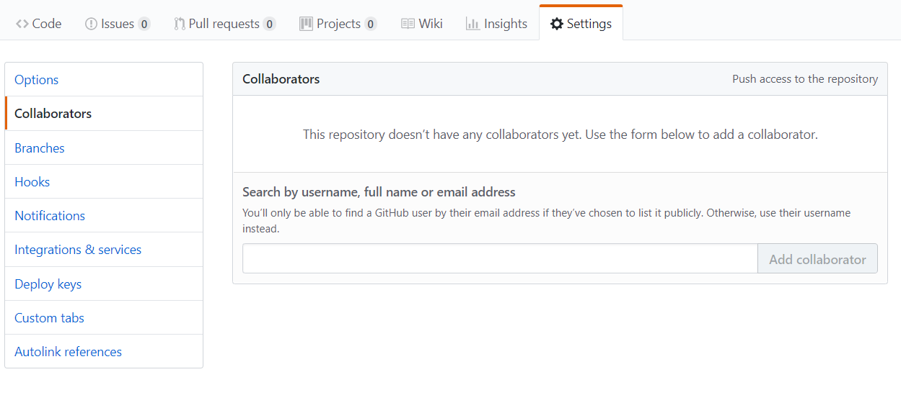
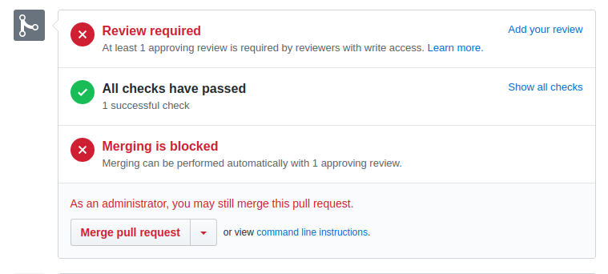

# Group Git React

Before we send you off on you're own, we're going to demonstrate a merge conflict for you!

## [Git Docs](https://www.git-scm.com/docs)

You have all been using git for a couple months now, but only as individuals. Today you will be getting a taste of how git works in groups.

### You do

Your team has just been assigned to make a few updates to the Shady Acres website, you have a tight deadline and this site is in desperate need of a few bug fixes and updates. Below you will find the tasks that need to be finished before this site can go live, divided up by team member.

#### Setup

Decide as a group who will be in charge of the repo. This person will be your Git Czar.

### Git Czar does

1. **Fork** and **clone** this repo from SEI-Bees.

1. Share your screen so everyone gets to see this process.

1. Create branch protection rules.
    - Click on settings and then branches
    - Add new rule to **master** branch (the screenshot says develop, use master)
    - Check the box for Require pull request reviews before merging
    - Check Require view from Code Owners
    - Save Changes 
    # 

    >This will make it so the git Czar has to review all changes and no one can accidentally push directly to master.

1. Share the link for your new repo with your teammates in Slack.

1. In GitHub, click on the **Settings** tab, and then navigate to **Collaborators & Teams**.

1. Add your teammates as collaborators. You will need their Enterprise usernames.
   # 

### All members do

1. The Git Czar can stop sharing their screen for now.

1. Using the Git Czar's link, **clone** their repo. **Do not fork**. 
    >Forking creates a new repo on your own account, but right now we don't want that. We want to all be working on the same repo.

1. `cd` into the newly cloned directory.

1. Run `$ npm i` to install all needed Node packages.

1. Run `$ npm start` to start the react app.

1. Decide who will be completing each set of tasks outlined below. There should be one person assigned to each set of tasks.

1. Complete your and **ONLY** your assigned set of tasks for the day.

<details open>
<summary> Member 1 tasks: Navbar</summary>
<br>
You have been assigned to fix a small problem with the Navbar and add a new link.

1. In your terminal, create a new branch `git checkout -b feature/update-navbar`.
1. Type `git branch -a` to see your branches and remotes. The branch you are currently on should have an asterisk next to it. It should look something like this:
```  
  master
* update-navbar
  remotes/origin/HEAD -> origin/master
  remotes/origin/master 
```

You can also check which branch you are on by running a `git status` which should give you something like this:
```
On branch update-navbar
nothing to commit, working tree clean
```

Complete the rest of your tasks on this new branch. **Do not work directly on the master branch!**

3. Navigate into `./components/Navbar`
1. Your client wants everything pixel-perfect! Change the margin of the h1 to `margin: 0 4px;`
1. We also need a link that allows users to view photos of the properties. Add a new link to the Navbar. The link should read "Photos" and for now it can just have an `href="#"` property.
1. Let's also separate those links a bit so they're easier to read. Add `padding: 0 5px;` to the Anchor styles.

At this point your tasks have been completed, you can now push your changes to GitHub:

7. `$ git add .`
1. `$ git commit -m 'Update Navbar'`
1. `$ git push origin update-navbar`
1. In GitHub, create a new pull request with a brief explanation of what you did.
1. If you are the Git Czar, wait until your teammates have let you know they have new changes ready to merge. If not, let your Git Czar know your pull request is ready. 

</details>

<details>
<summary> Member 2 tasks: Main</summary>
<br>
You have been assigned to fix a typo and add a little styling to the Main component.

1. In your terminal, create a new branch `git checkout -b feature/update-main`.
1. Type `git branch -a` to see your branches and remotes. The branch you are currently on should have an asterisk next to it. It should look something like this:
```  
  master
* update-main
  remotes/origin/HEAD -> origin/master
  remotes/origin/master 
```

You can also check which branch you are on by running a `git status` which should give you something like this:
```
On branch update-main
nothing to commit, working tree clean
```

Complete the rest of your tasks on this new branch. **Do not work directly on the master branch!**

3. Navigate into `./components/Main`
1. Did you catch the typo? Delete the last 'r' from the word 'Reserve' in the first div.
1. Make the text more readable. Add the line `flex-direction: column;` to the end of your Div styles.
1. Center the text with `text-align: center;`

At this point your tasks have been completed, you can now push your changes to GitHub:

7. `$ git add .`
1. `$ git commit -m 'Update Main'`
1. `$ git push origin update-main`
1. In GitHub, create a new pull request with a brief explanation of what you did.
1. If you are the Git Czar, wait until your teammates have let you know they have new changes ready to merge. If not, let your Git Czar know your pull request is ready. 
</details>

<details>
<summary> Member 3 tasks: Footer</summary>
<br>
You have been assigned to add credits and fix a bug in the Footer component.

1. In your terminal, create a new branch `git checkout -b feature/update-footer`.
1. Type `git branch -a` to see your branches and remotes. The branch you are currently on should have an asterisk next to it. It should look something like this:
```  
  master
* update-footer
  remotes/origin/HEAD -> origin/master
  remotes/origin/master 
```

You can also check which branch you are on by running a `git status` which should give you something like this:
```
On branch update-footer
nothing to commit, working tree clean
```

Complete the rest of your tasks on this new branch. **Do not work directly on the master branch!**

3. Navigate into `./components/Footer`
1. Currently there is no footer. Make sure everyone who looks at this site will know who built it! Add `<span>Shady Acres</span> ©2020 built by name, name, and name.` (replace 'name' with each of your team's names) to `<Credit>`
1. It might look a little better if the text is centered. Add styles to `Credit` to center the text.
1. Let's also give the text a little more padding. Add `padding: 5px;` to `Credit`

At this point your tasks have been completed, you can now push your changes to GitHub:

7. `$ git add .`
1. `$ git commit -m 'Update Footer'`
1. `$ git push origin update-footer`
1. In GitHub, create a new pull request with a brief explanation of what you did.
1. If you are the Git Czar, wait until your teammates have let you know they have new changes ready to merge. If not, let your Git Czar know your pull request is ready. 
</details>

### Code Review

1. As a group, discuss what changes you made.

1. Have the Git Czar share their screen again.

1. On Github, click on the Pull Requests tab. You should see pull requests from all team members.

1. Review pull request

1. As Git Czar you should see the following (pic below)
    >If you set things up correctly only the git master will be able to see the add your review option)

    # 

1. Click on add your review

1. If there is no merge conflict, you should be able to merge the new code.

1. Go ahead and merge it!

1. Once all conflicts have been resolved and the Git Czar has finished merging all changes, all members should return to their local master branch `git checkout master`

1. Run `git pull` to make sure you have the most up to date version of master.

1. You should now have the same code as everyone else, including all the changes that were made!

### Merge Conflict!!!

Okay last min changes have came in and we need fix a small issue with the app. 

1. Each member should create a new branch `git checkout -b hotfix/add-year` In this new branch. 

1. Go to App.js and change the inital state of year to the year you were born (or some other random year).

1. Commit your new changes and make a new pull request. 

1. At this point you should see that there is an issue and that the changes can not be merged into master until the merge conflit has been resolved. If you can not rememeber how to remedy this look back at our [git teams lesson](https://git.generalassemb.ly/sei-nyc-bees/git-teams) to look for a soulution!
