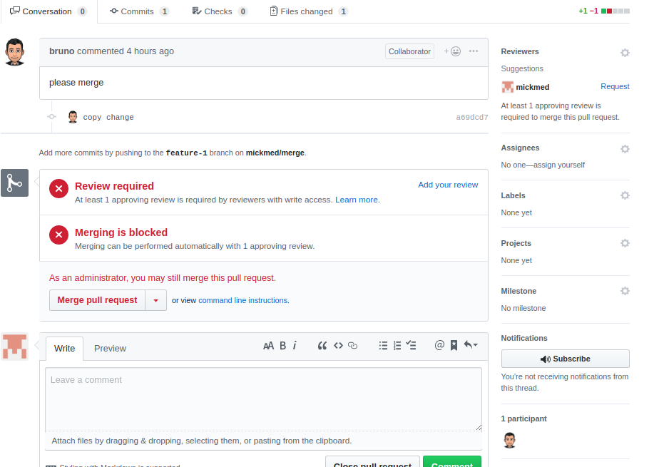

###  Git Group exercise
  
  
#  Group Git
  
  
##  [Git Docs](https://www.git-scm.com/docs )
  
  
Once settled in your groups decide who will be the Git Czar
*********
###  Git Czar does:
  
  
1. On GitHub(personal GitHub **NOT** Enterprise) make a project repo called `git-group-practice`. Make it public and initialize a README).
  
2. Add a develop branch on your remote repository 
#  
  
  
3. Now that you have a remote `dev` branch let's go ahead and set it as the **default** branch of our repository.
  
  
**The default branch is considered the base branch in your repository, against which all pull requests and code commits are automatically made, unless you specify a different branch.**
  
[Setting the default branch](https://help.github.com/en/github/administering-a-repository/setting-the-default-branch )
  
Your default branch is named `master`. However, we suggest using a `dev` branch instead of `master`. If you have admin rights over a repository on GitHub, you can change the default branch on the repository.
  
  
In Settings, in the left menu, click Branches.
  
Update the `dev` to be the default branch.
  

  
4. Create branch protection rules  
- Click on settings and then branches
- Add rule to develop branch    
- Check Require pull request reviews before merging
- Check Require view from Code Owners   
- Save Changes   
- **Don't forget to do the same to your master branch**
#  
  
  
4. Share the git repo link with your team in slack.
  
5. In Settings, under Collaborators, add your team members.
  
6. Your team members should have received an invitation to collaborate via email.
  
7. **Clone** the repo to your local machine. It's your own repo so **Do not fork.** `cd` into the `git-group-practice` directory.
  
  
  
  
  
  
  
  
  
  
###  The rest of the members:
  
  
1. **Clone** the repo to your local machine. **Do not fork.** `cd` into the `git-group-practice` directory.
  
1. Type `git branch -a` to see which branch you are on, as well as, your remotes. The branch you are on is supposed to have a `*` in front.
  
```
* develop
  master
```
  
1. Create a branch as yourname-dev `git checkout -b yourname-dev`. 
    > (i.e., git checkout -b svetla-dev)
  
1. Open the `README` in the text editor.
  
1. Navigate to [Facts Site](https://www.thefactsite.com/ ) and select a fun and interesting fact of your choice. Copy and paste the text into the `README` file. You can do this task at the same time.
  
  
1. Check to see which changes were made using `git status`. 
  
  
**It should look something like this:**
  
```
On branch svetla-dev
Changes not staged for commit:
  (use "git add <file>..." to update what will be committed)
  (use "git checkout -- <file>..." to discard changes in working directory)
  
	modified:   README.md
  
no changes added to commit (use "git add" and/or "git commit -a")
```
  
7. `git add README.md` for staging and then `git commit -m "add readme"`.
  
8. All members should push their changes.
  
  `git push origin svetla-dev`
  
###  All members do:
  
- On Github, under the Your Branches section, make a pull request using the new pull request button, base should be set to head and compare will be the yourname -dev. 
  
*OR*
  
- In the pull request tab, select New Pull Request, and then select base to be dev and compare will be the yourname-dev branch. Once confirmed click on Create Pull Request.
  
  
###  Git Czar does:
  
1. On Github, click on the Pull Requests tab. You should see pull requests from all team members.
  
2. Choose one, got to Files Changed, review the changes, then go to Conversation  and merge it in.
  
3. Select the next pull request and notice there is most likely a merge conflict. 
  
4. Request the team member to resolve the merge conflict.
  
5. Once the merge conflict is resolved, merge it in.
  
###  Team member with a merge conflict
  
  
1. Make sure you are on yourname-dev
  
`git checkout yourname-dev`
  
2. Get the **latest changes** from `dev` by running `git pull origin dev` (very important step).
  
3. The text editor will highlight the merge conflict like so:
  
```
# git-group-practice
<<<<<<< HEAD
*YOUR VERSION*
=======
*What's currently on dev branch*
>>>>>>> commit hash
```
  
4. The objective is to have both your changes, so in this situation simply remove `<<<<<<< HEAD`, `=======` and `>>>>>>> commit hash`
  
5. The text editor may have the following options as well:
  

   You may choose to `Accept Both Changes`.
  
6. Add, commit and push your changes. 
  
7. Go back to GitHub, on Pull Request tab, select your Pull Request again and this time you should see: 
  

  
8. Inform the Git Tzar that your code is ready to be merged.
  
##  Group Members
  
  
- Clone repo  
- Checkout to develop 
- Create feature branch  
```bash
git checkout -b feature/<your first name here>
``` 
- Set branch upstream 
```bash
git push --set-upstream origin <your branch name>
``` 
  
  
  
- Each member open your respective .txt file  
- Make some changes  
- Add, commit and push changes  
- Make pull request on develop branch  **(not master)**
  
<br/>
  
  
###  Git Tzar(wait for assistance)
  
  
After you have the changes from all members in the `dev` branch it is time we merge `dev` into `master`. 
  
  
1. `git checkout master`
2. `git pull origin dev`
2. `git merge dev`
  
The --no-ff flag causes the merge to always create a new commit object, even if the merge could be performed with a fast-forward. This avoids losing information about the historical existence of a feature branch and groups together all commits that together added the feature.
  
[](https://nvie.com/posts/a-successful-git-branching-model/ )
  
3. `git push origin master`
  
```
➜  test-group-git git:(dev) git checkout master
Switched to branch 'master'
Your branch is up to date with 'origin/master'.
➜  test-group-git git:(master) git merge dev
Updating 29fb49d..804ab70
Fast-forward
 README.md | 5 +----
 1 file changed, 1 insertion(+), 4 deletions(-)
➜  test-group-git git:(master) git push origin master
Total 0 (delta 0), reused 0 (delta 0)
To https://github.com/svetlasyrimis/test-group-git.git
   085148e..804ab70  master -> master
```
  
  
###  Important commands:
  
 `git checkout dev` —— switch to the dev branch
 `git pull origin dev` ——— get the changes from the `dev` 
 `git checkout yourname-dev` ———— to switch your branch
 `git merge dev` ———- to merge dev changes into your branch 
  
  
  
 Delete your remaining local branches `git branch -d yourname-branch` [-d or -D ?](https://koukia.ca/delete-a-local-and-a-remote-git-branch-61df0b10d323 )
 Delete the remote branches `git push origin --delete remote-branch`
  
  
`git log --oneline --decorate --graph --all` to see the history of what we just did. 
  
  
  
#    SOFTWARE ENGINEERING IMMERSIVE
  
  
#  Git Group Lab
  
  
  
Gather in to groups for this lab. Assign one member of your group as a git master. This exercise is for practicing group work with git. You will learn how to set up a repo so that only one member (git master) will be able to merge pull requests.
  
<hr/>
  
##  Git Master
  
####  1) Add a develop branch on your remote repository 
  
#  
  
  
<br/>
  
  
####  2) Create branch protection rules  
  
- Click on settings and then branches
#  
  
- Add rule to develop branch    
- Check Require pull request reviews before merging
- Check Require view from Code Owners   
- Save Changes   
- **Don't forget to do the same to your master branch**
#  
  
  
  
<br/>
  
####  3) Create multiple .txt files with member name and assign task to member  
  
- Click on Create new file
#  
  
  
  
<br/>
<hr/>
  
##  Group Members
  
  
- Clone repo  
- Checkout to develop 
- Create feature branch  
```bash
git checkout -b feature/<your first name here>
``` 
- Set branch upstream 
```bash
git push --set-upstream origin <your branch name>
``` 
  
  
  
- Each member open your respective .txt file  
- Make some changes  
- Add, commit and push changes  
- Make pull request on develop branch  **(not master)**
  
<br/>
<hr/>
  
  
##  Git Master
  
- Review pull request
- As Git Master you will see the following (pic below)
- (If you set things up correctly only the git master will be able to see the add your review option)
- Click on add your review
- Once reviewed you will be able to merge the pull request
  
#  
  
  
  
<hr/>
  
You can read more at Github Help - [Administering a Repository](https://help.github.com/en/github/administering-a-repository )
  
  
  
  
  